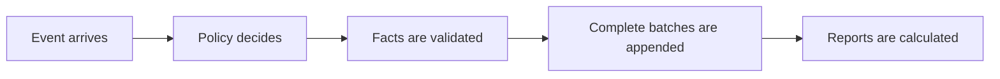

# Architecture & Trade-offs

## What exists today

This core has one job: receive the supplied events, record what happened, and calculate balances without changing history. It runs entirely in memory because the assessment excludes databases, services, and user interfaces.

An event is a request such as a credit, debit, authorization, settlement, or reversal. Policy decides whether the request is valid and what it should produce. The journal appends validated facts in complete batches. Reports derive balances and authorization states from the stored facts.

Three guarantees organize the implementation:

- **Exact money:** AED is stored in hundredths and BHD in thousandths. Currency arithmetic uses integers, never binary floating point.
- **Permanent history:** an accepted fact is never edited or deleted. A correction adds a linked opposite fact.
- **All or nothing:** every journal batch is appended completely, or not appended at all.

One event call may append two ordered batches: a prior-day fee batch, then the event-result batch. It exposes both, but has no durable transaction around the pair, crash survival, or protection from concurrent writers. Those are production guarantees, not claims made by this implementation.

### The boundary I chose

Business rules live in policy and orchestration. The journal checks that the facts produced by those rules fit together: currency matches the account, direct postings match their event, authorization transitions match their request, settlements consume an active hold only once, and reversals point to one exact debit.

This is a **customer-account subledger**. A positive posting increases the customer's displayed balance and a negative posting reduces it. It is not the bank's complete accounting book because the prompt gives only the customer side of each movement. The missing side is the largest deliberate cut in this design, explained below.

## Append-only at 100x

Append-only keeps the story explainable. At 100x volume, **speed and memory break first**. Each append copies the immutable ledger tuple, several validations rescan earlier facts, and replay retains full-prefix snapshots. The journal's fact history grows without bound by design; those replay snapshots add avoidable quadratic state on top of it.

The supplied stream has ten events. At 100 times that input, the core would process about 1,000 events. Because repeated copying and retained prefixes can grow roughly with the square of the event count, that part of the work can become about 10,000 times larger. This is an explanation of the algorithm, not a throughput benchmark.

<!-- VISUAL: scale -->

### A separate correctness failure

Concurrency is not the first 100x capacity failure: it is already unsafe with two writers. Both can read the same version, approve their event, and create a different successor with the same sequence number. Both results can look valid in isolation.

### Cheapest change first

The cheapest structural change is to stop retaining full snapshots after every replay step. Keep one current ledger and only the newly appended range for each step. That removes the avoidable prefix copies without changing business behavior. Next, add indexes for frequent lookups such as account postings, authorizations, fees, and reversals.

The next production step is one transactional database writer:

- append only when the expected journal sequence still matches;
- enforce unique event and record identities in the database;
- store the event result and its pending outbound message in the same transaction;
- build balance checkpoints and indexes from measured queries; and
- prove backup restoration before claiming durability.

I would not start with Kafka, microservices, sharding, or multi-region writes. Those tools introduce new ordering and recovery problems before this workload proves that one database writer is insufficient. Fee reconciliation must stay account-local so one account's policy failure cannot reject another account's event. If later measurements require partitioning, one ordered owner per account is the natural next boundary. A transfer between two accounts would still need a separate guarantee that both sides succeed or both fail.

## Value-dated entries in production

An entry has two dates and one sequence. **Booking date** says when the bank recorded it. **Value date** says when its financial effect applies. **Journal sequence** says which committed batch came first.

<!-- VISUAL: clocks -->

A late entry is appended now but can carry an earlier value date. No existing record changes. A recalculated past balance may change because it includes one more fact, which can affect fees, interest, statements, reconciliation, and downstream data. In production, the previously issued result must remain stored, and a correction must create a linked replacement.

I assume “UAE-licensed bank” means an institution licensed and supervised by the CBUAE. Its consumer standards require statements to show opening and closing balances, deposits, withdrawals, interest or profit, and fees,[^1] with accurate disclosures and calculations.[^2] UAE AML/CFT rules also require records sufficient to reconstruct individual transactions.[^3] These rules do not prescribe this architecture, but they make untracked corrections risky.

### One control before go-live: protect closed-period results

The current core rejects an entry whose value date falls inside a finalized period. Before handling real customer money, I would keep the normal path blocked and send late entries to a separate correction workflow. It must:

- hold the entry instead of posting it;
- calculate and show everything it would change;
- preserve old outputs and create linked replacements; and
- save the correction and all replacements together, or save nothing.

Until those steps succeed, the issued result stays unchanged. This prevents an untracked correction. An approval step may be added, but it does not replace the enforced rule.

## Authorization lifecycle

An authorization is a reservation, not a debit. It reduces the amount still available to spend. Settlement is the later event that actually removes money and releases any unused reservation.

For an approved authorization, the honest answer in this model is **none**: only one final settlement ends it. The only other terminal request outcome represented is **decline**: insufficient available balance records a decline once and creates no hold. Production must add these non-settlement endings:

<!-- VISUAL: authorization -->

- **Expire:** the deadline passes without a charge; append an expiry and release the remaining hold once.
- **Void or cancel:** the purchase is cancelled or duplicated; append the authenticated instruction and release the remaining hold once.
- **Authorization reversal:** the merchant or network says the approval will not be used; append a linked reversal and release the remaining hold once.

Each ending is idempotent, and a later settlement against that ended hold is rejected. Amount changes and partial releases adjust an active hold; they do not end it. An unknown result is not an ending: reconcile the stored result before changing the hold. A refund or chargeback happens after settlement and adds a linked money movement instead of changing the old hold.

## What I cut and why

### The biggest cut: this is not double-entry

The prompt supplies no counter-account, so this core records only the customer side. In production, it could sit behind a balanced general-ledger boundary: every overall movement needs counterpart entries and reconciliation. A real double-entry transaction has equal debits and credits. A customer deposit is a bank liability: money owed to the customer.[^4]

The deposit example below is conceptual. It shows the missing accounting shape; it does not claim that the assessment supplied a real cash or settlement account.

<!-- VISUAL: double-entry -->

### What “double-entry” must mean

- every transaction contains at least one debit and one credit;
- total debits equal total credits inside that transaction;
- balancing happens separately for each currency;
- every leg names a real account and uses an explicit debit or credit side; and
- all legs commit together, so half a movement is never visible.

Those are the accounting guarantees. Production safety adds immutable posted entries, linked corrections, unique request identities, ordered writes, audit evidence, period controls, reconciliation, backups, and tested recovery. Modern ledger implementations commonly group two or more entries into one atomic balanced transaction and distinguish debit-normal from credit-normal accounts.[^5]

### Other deliberate cuts

- **No persistence:** sufficient for a six-day replay, but a crash can erase the journal. Production needs durable atomic append and tested restoration.
- **Thin currency and product rules:** the fixture has no FX and supplies only an AED fee. Missing rules can block a close or misprice it; production needs effective-dated configuration and sourced, explicitly rounded FX.
- **Integer days and one terminal close:** these match the fixture but omit real cut-offs, calendars, recurring periods, and post-close correction. Production needs timestamps, period state, and the controlled workflow above.
- **Narrow payment lifecycle:** the fixture needs only one final capture and direct-debit-principal reversal. Production needs expiry, void, partial capture, and explicit settlement, fee, refund, and dispute corrections.
- **Policy label and trusted local calls:** enough for local replay, but a version string and caller are not evidence. Production needs immutable effective-dated policy identity, actor controls, audit, and controlled delivery.
- **One global sequence:** enough for one replay, but concurrency and multi-account transfers lack a durable atomic winner. Production needs ordered transactions before measured partitioning.

I would first make one ledger balanced, durable, recoverable, controlled, and reconcilable. I would distribute it only after measurements show which limit needs it. The tests prove the six-day behavior, not a full production bank ledger.

[^1]: [CBUAE Consumer Protection Standards, Article 2, clause 2.1.2.9](https://rulebook.centralbank.ae/en/rulebook/article-2-disclosure-and-transparency)
[^2]: [CBUAE Consumer Protection Regulation, Article 2, clause 2.1.2.10](https://rulebook.centralbank.ae/en/rulebook/consumer-protection-regulation)
[^3]: [UAE Cabinet Resolution No. 134 of 2025, Article 25](https://rulebook.centralbank.ae/en/rulebook/article-25-13)
[^4]: [Bank of England, customer deposits as bank liabilities](https://www.bankofengland.co.uk/speech/2026/july/nathanael-benjamin-speech-at-omfif)
[^5]: [Modern Treasury, debits, credits, account normality, and balanced transactions](https://docs.moderntreasury.com/ledgers/docs/guide-to-debits-and-credits)
