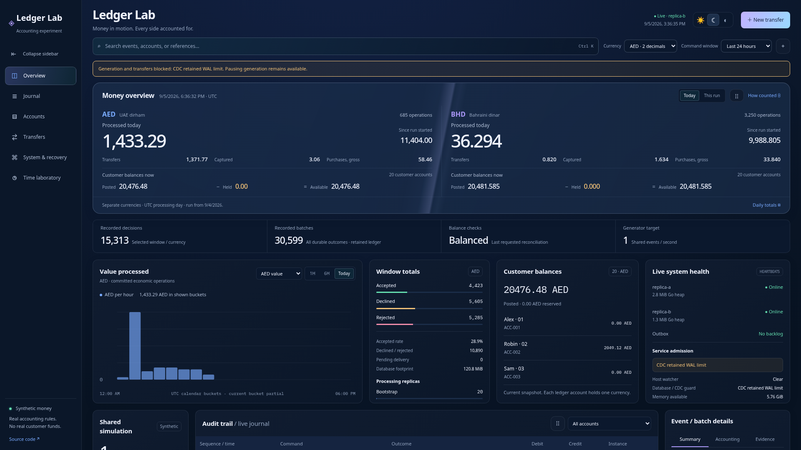

# Ledger Lab

A double-entry ledger simulation, built as a Go service with PostgreSQL and a live web dashboard. This is the canonical application on `feat/go-ledger-service`. It is a proof of concept with synthetic money, not a bank or a production-ready financial product.

Two instances run the same application. They share the database, coordinate concurrent requests, and record decisions, accounting entries and notification work together. The dashboard shows what actually happened, including declined requests, precision errors, holds, partial capture and retries.

## Run locally

From the repository root, with Docker Compose:

```bash
docker compose up --build -d
```

Open **http://localhost:8088**. Startup is not proof of readiness: follow the [service instructions and checks](service/README.md). The generator has a shared target and safety limits; opening another browser does not create another generator.

The optional [reporting experiment](deploy/local/lake/README.md) connects PostgreSQL CDC to Iceberg and self-hosted ClickHouse. It is not required for the transactional dashboard to run.

## Understand the complete service

The [implementation and scaling guide](docs/ledger-lab-guide.md) explains the project from funding and double-entry through concurrent commits, delivery, CDC and reporting. It distinguishes working code, local observations and proposed changes, including resource tuning, partitioning, sharding, database availability and dbt transformations. A separate [PDF edition](output/pdf/ledger-lab-implementation-guide.pdf) is available; it does not replace the submitted assessment PDF.

The [5 September evidence](docs/evidence/2026-09-05/README.md) includes a real reporting failure: a connected CDC consumer stopped advancing its acknowledged position, retained WAL grew, and the financial admission guard stopped new simulation work. The investigation also found offset timeouts and accumulated lake snapshots. This is not a claim of a repaired, unattended reporting pipeline.

The supplied v2 design is now the working frontend, using exact server aggregates rather than a demo adapter. This local capture deliberately retains the admission warning; it shows the actual observed state.



## What matters in this model

- Money uses exact minor units. AED and BHD are separate; there is no implicit currency conversion.
- Funding has a counterpart entry. Transfers move existing balances and commit both sides together.
- Holds reserve available funds without moving money.
- Retrying the same command ID and payload returns the recorded result. Reusing that ID with different contents is a conflict.
- Facts are append-only. A later entry can change a historical projection without editing an earlier fact.
- Notifications can be delivered more than once. The receiver deduplicates them; delivery failure does not undo committed money.

## Where to look

| Location | Purpose |
| --- | --- |
| [service/](service/) | Go application, SQL queries, migrations, frontend and tests |
| [service/README.md](service/README.md) | Running the service, behavior, checks and current limitations |
| [compose.yaml](compose.yaml) | Local two-replica stack and optional reporting services |
| [Implementation plan](docs/go-service-plan.md) | Intended architecture, milestones and deployment gates; not a completion claim |
| [Decision coverage](docs/go-service-decision-coverage.md) | Relationship to the original assessment decisions |
| [Implementation guide](docs/ledger-lab-guide.md) | Current service, evidence, resource investigation and staged scaling plan |
| [WORKLOG.md](WORKLOG.md) | Changes, evidence, failed checks and disclosed AI assistance |

## Status and boundaries

The local service and dashboard work. Local tests cover exact arithmetic, the six-day fixture, concurrent idempotency, generator fencing, notification retries, reconciliation and selected recovery scenarios. That does not prove the whole deployment plan is complete.

VPS deployment remains gated by available memory, bounded storage and retention, further CDC recovery, and other checks in the plan. Metabase integration is not yet complete. The [open draft PR](https://github.com/sabino/account-ledger-core/pull/2) is for visibility, not a claim of release readiness. CI results should be checked on the PR; local green tests do not imply remote CI is green.

## Preserved Python assessment

The Python implementation is retained as the assessment/reference model, not the service runtime. Its code and tests remain in their original locations so existing commands and historical links keep working. See the [Python assessment guide](docs/python-assessment.md).

The submitted revision is [5a15146](https://github.com/sabino/account-ledger-core/tree/5a15146c0b18a6e34a5c3deb5c18f29f67f42c25). Later Python hardening is documented separately. The root `ARCHITECTURE.md`, `AMBIGUITIES.md`, `NUMBERS.md` and `REJECTED.md` describe that assessment, not the full Go service. The [submitted PDF](output/pdf/architecture-and-trade-offs.pdf) is preserved unchanged.

This branch does not change what was submitted, and it has not been merged into `main`.
