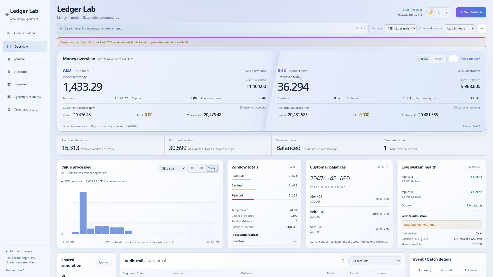
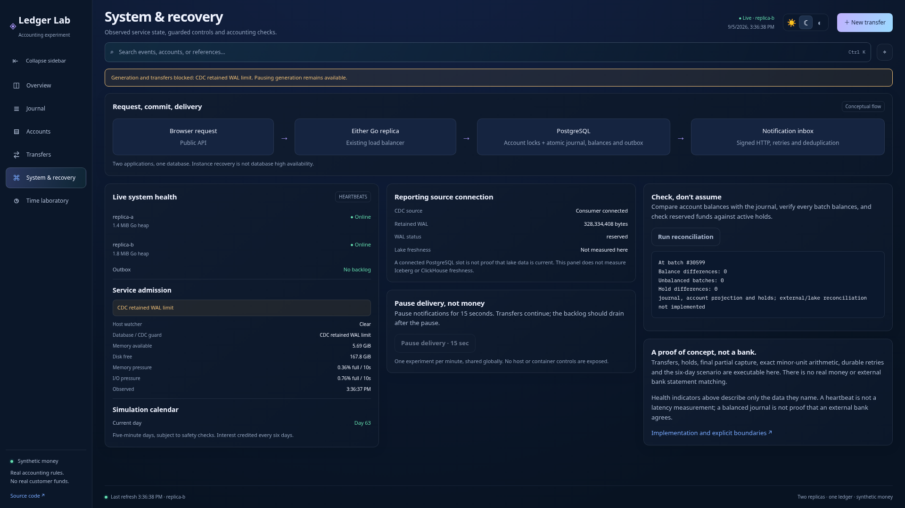
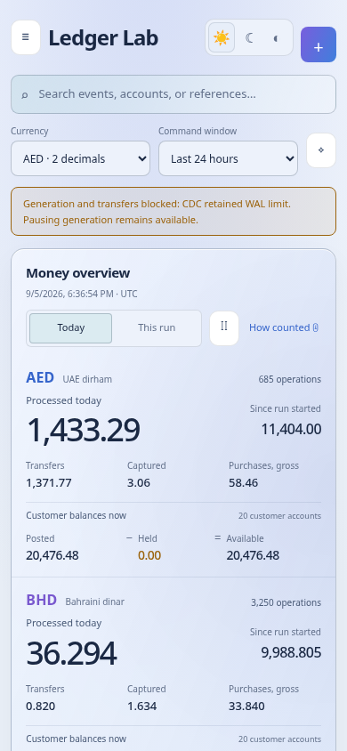
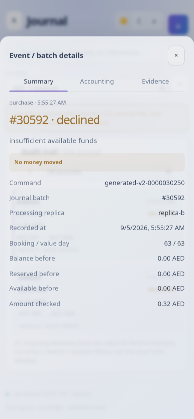

# Local evidence - 5 September 2026

This is a local development observation, not a production benchmark. The source revision before this update was `f0ba99f`. The interactive Compose project is `ledger-lab`; the separate, paused compact experiment is `ledger-budget`. Other local test containers were also running. Nothing on the VPS was changed.

## CDC incident observed around 18:00 UTC

- The demo had 30,599 journal batches and no new batch since `2026-09-05T08:55:36.187867Z`. Its calendar was at Day 63 with no pending or blocked account closes. This does not prove every preceding daily transition independently passed an audit.
- Both API replicas were healthy. Host telemetry was safe, but `guard_fresh=false` and `guard_reason="CDC retained WAL limit"` prevented further simulation admission. Pending notification deliveries were zero.
- PostgreSQL reported the `ledger_lake` slot as active, with `wal_status=reserved`. At 18:00 UTC it retained 313,109,016 bytes (298.60 MiB); the slot had not been invalidated. `confirmed_flush_lsn` was `0/2047BCE0`, whereas subsequent `sent_lsn` had reached `0/32D090F8`. A connected consumer was not proof of checkpoint progress.
- CDC repeatedly logged `Flush of the offsets failed, canceling the flush` with `TimeoutException`. An offset-table commit reported 33.296 seconds. Configuration requests an offset flush every five seconds but does not explicitly set a flush timeout. No controlled change has yet established a single root cause or a successful repair.
- At 18:01 UTC, the Iceberg offset table held one current row in one 2,228-byte data file, but retained 2,465 snapshots. The journal table held 40,991 rows across all runs in 783 current files (6,373,864 bytes), with 783 snapshots. Both tables reported 100 metadata-log entries. Local lake filesystem allocation was 8.7 GiB, not 6.4 MB: current table bytes exclude historical data, metadata, storage-engine overhead and unreclaimed space.
- The lake container had restarted three times. `OOMKilled=false` describes its current state and does not prove that every previous exit was unrelated to memory. This observation alone does not establish the cause of those restarts.

The source-side guard protected new financial work, not every byte written on the host. Heartbeat/control writes continued to produce WAL. Offset retries and lake maintenance could continue allocating storage while the simulation was blocked. This is a specific reason the present guards are not a complete storage quota.

## Memory observation

One `docker stats --no-stream` sample around 17:59 UTC, rounded to MiB:

| Service | Main usage | Main ceiling | Compact usage | Compact ceiling |
| --- | ---: | ---: | ---: | ---: |
| Go API A | 12.32 | 128 | 11.05 | 64 |
| Go API B | 18.64 | 128 | 17.96 | 64 |
| Watcher | 12.05 | 48 | 11.01 | 32 |
| Proxy | 2.16 | 64 | 2.23 | 32 |
| PostgreSQL | 141.90 | 512 | 50.77 | 192 |
| CDC | 506.40 | 768 | 299.10 | 384 |
| Lake/catalog | 287.30 | 384 | 122.10 | 192 |
| ClickHouse | 171.40 | 1,024 | 120.40 | 192 |
| Sum of this sample | 1,152.17 | 3,056 | 734.62 | 1,152 |

Docker samples are observations, not reservations or exact simultaneous high-water marks. Main was admission-blocked; compact was paused. They are different workloads and histories, not an A/B performance comparison. Bootstrap containers, the OS, Docker, builds and unrelated local services are excluded. The non-compact budget configuration in Git has a 1,280 MiB ceiling; the running compact overlay has 1,152 MiB.

At a nearby observation, CDC cgroup memory was 550,297,600 bytes. `jcmd 1 GC.heap_info` showed roughly 101 MiB of used Java heap and 97 MiB of used metaspace. The container was not just its Java heap: native/direct allocations, code, stacks and file-backed memory also matter. Serial GC was already enabled. Lowering `-Xmx` or enabling Serial GC is not by itself a demonstrated fix.

PostgreSQL had `shared_buffers=96MB`, `work_mem=2MB`, 30 allowed connections and 17 observed connections (including the diagnostic). `logical_decoding_work_mem` and `maintenance_work_mem` were each 64 MiB; autovacuum inherited the latter. `fsync`, `full_page_writes` and `synchronous_commit` were on. Database allocation was 124,163,775 bytes; the WAL directory held 335,544,320 bytes. The mean stored JSONB envelope was 715 bytes, maximum 1,560 bytes in this fixture mix. None of these are a universal event size or an uncompressed wire-size estimate.

## Reproduce without changing financial data

```bash
docker stats --no-stream
docker inspect ledger-lab-lake-1 --format '{{.RestartCount}} {{.State.OOMKilled}}'
docker logs --tail 100 ledger-lab-cdc-1
docker exec ledger-lab-cdc-1 jcmd 1 GC.heap_info
docker exec ledger-lab-cdc-1 jcmd 1 VM.flags
node service/tests/lake-inventory.mjs ledger-lab
curl --fail http://localhost:8088/api/status
```

Use PostgreSQL's `pg_replication_slots`, `pg_stat_replication`, `pg_stat_wal`, `pg_settings` and relation-size functions to distinguish WAL backlog, process memory and table storage. Compare LSNs over an interval; do not infer progress from one active flag. The inventory has bounded reads and performs no compaction or deletion. A typo in the first diagnostic used `recorded_at`; the actual journal column is `created_at`, and the corrected query produced the timestamp above.

## Checks during this update

- Go vet and unit/race tests passed. The full application-role integration suite passed in 44.176 seconds. The financial test also passed separately after the UTC-duration query adjustment.
- The read-only financial HTTP smoke passed, as did eleven pure lake comparison/chunk/metadata tests. At `2026-09-05T18:20:08.324513Z`, today's processed totals were AED 1,433.29 and BHD 36.294. Run totals were AED 11,404.00 and BHD 9,988.805. These are synthetic accounting values, not throughput measurements.
- Internal reconciliation at cutoff 30,599 returned zero account-balance discrepancies, zero hold discrepancies and zero unbalanced batches.
- The live lake comparison captured cutoff 30,599, matched eight chunks through batch 8,000, then failed querying 8,001-9,000 with ClickHouse error 159 (`TIMEOUT_EXCEEDED`, 15-second limit). Two earlier transport-timeout retries had already been used. Partial rows returned with a failed query were not accepted. There is no fresh full-prefix agreement claim for this run.
- Only the local API containers were rebuilt for the new read-only endpoint and frontend. Existing database and lake volumes, CDC slots and safety limits were preserved. No load boost, guard override, resnapshot or retention deletion was performed.

Screenshots below show the actual local integration, including its guarded state. They are not evidence of a repaired CDC pipeline.

## Frontend verification

The supplied v2 design is connected to the real APIs, without its demo adapter. Formatting, TypeScript compilation and all fourteen frontend tests passed. Two new tests distinguish missing values from genuine zero and preserve exact formatting beyond `Number.MAX_SAFE_INTEGER`, including BHD precision and negative amounts.

Browser checks covered Overview, Journal, Accounts, Transfers, System and Time. All six routes had no document-level horizontal overflow at 1920px dark, 390px dark, 320px in both themes and 960px light. The last width checks narrow reflow, not an actual browser zoom or a full accessibility audit. Additional layout observations covered 768, 1024 and 1440px. Desktop sidebar/main boundaries were checked separately; final screenshots were taken after viewport/theme transitions settled.

- The actual monetary snapshot returned AED 1,433.29 and BHD 36.294 processed today. The display uses complete aggregates, not the recent journal's row count or amounts.
- Pausing the monetary display kept its values and as-of timestamp unchanged while the operational clock continued. This is a display control, not a generator pause.
- A browser-only aborted financial request retained the previous real snapshot and showed a stale label. The interception was removed afterward; screenshot data was not fabricated.
- Statement page two preserved cutoff 30,599. The browser exported a complete selected-account CSV with 289 posting rows plus its header. Separate HTTP statement checks verified all 850 AED ACC-001 postings and 353 BHD ACC-021 postings at that cutoff.
- Internal reconciliation returned zero account, hold and batch discrepancies. It does not include the lake or external statement adapter; the UI states that scope.
- Unsafe admission disabled transfers, rate increases and the bounded delivery-pause experiment. Generation pause remained available. No financial command, rate boost or fault experiment was submitted for these captures.

The latest rebuild restarted only the two local API containers. Read-only financial, analytics and statement HTTP checks passed again afterward. The original assessment PDF's SHA-256 remained `118e2afe15298c70a392ecb891b91afdd6edb68eee154fade0e9ffe922916884`.

## Screenshots

These captures use the rebuilt service at `http://localhost:8088`, not a standalone HTML preview. The command window is explicitly set to the last 24 hours where shown; monetary Today uses UTC. The last journal event and the current API clock differ because new financial admission is blocked.

### Overview — desktop, dark


### Overview — desktop, light



### System — desktop



### Mobile

The Overview capture is the first 390 by 844 viewport. The Journal capture shows its event-inspector sheet at the same size; rows are cards on mobile, not squeezed desktop columns.





Full-page extras show the content below the first viewport: [desktop Overview, 1920 by 1708](overview-desktop-full.png) and [mobile Overview, 390 by 4067](overview-mobile-full.png). The latter is one mobile route, not all application workspaces stacked into a single page. Both were visually reviewed; neither is labeled as a one-viewport layout.
