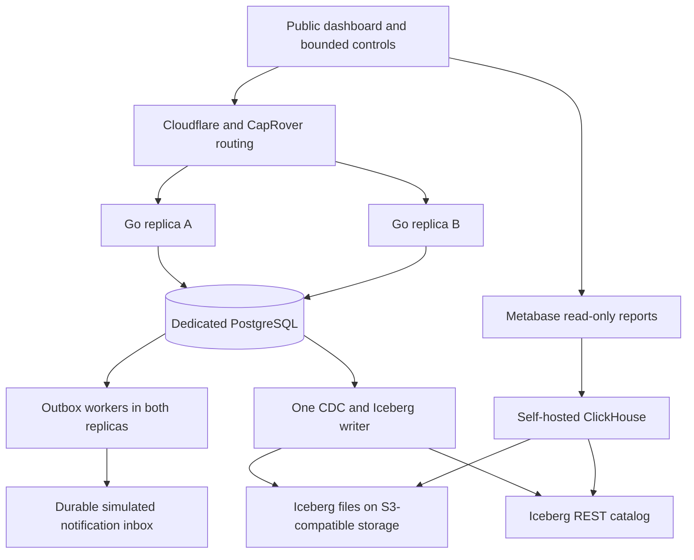

# Go ledger service: implementation and exercise plan

Status: implementation started; not deployed or benchmarked. Prepared with Codex on 2026-09-04, after the assessment submission. Branch: `feat/go-ledger-service`.

This document plans the follow-on service. It does not replace the submitted `ARCHITECTURE.md` or PDF. Submitted revision: `5a15146c0b18a6e34a5c3deb5c18f29f67f42c25`; Python hardening was subsequently merged in `6ae374ff5ddce5889d46dac0bac9f7223539b40c`.

## 1. Outcome and boundaries

Build a public, controlled simulation at `ledger.sabino.pro`: two instances of the same Go application accept requests, coordinate through PostgreSQL, and expose actual decisions, postings, recovery, and reconciliation. Replicate committed facts through CDC to Iceberg; query the lake with self-hosted ClickHouse and present curated Metabase reports.

The project demonstrates a bounded financial service and its failure modes. It does not claim banking certification, production customer readiness, host-loss availability, or measured scale before tests exist. Money and people are synthetic. Container failure is in scope; destroying the VPS is not.

Firm requirements:

- Preserve the Python assessment and exact customer-side fixture results.
- Extend it with balanced double-entry, same-currency transfers, durable idempotency, and concurrent processing.
- Public controls have one shared resource budget, not a separate generator per browser.
- Background generation runs slowly unless paused by a user, fault exercise, retention limit, or resource guard.
- Existing VPS services remain running. Only `judite-updates` and `judite-vs` were approved for stopping; their data was retained.
- PDF, `bm`, Seafile, website services, and other existing workloads are not deployment resources to reclaim.
- The ledger database, WAL, and any catalog database use local persistent disk, never an rclone mount.
- All deployed state, images, limits, and versions are documented. No secrets or private interview notes enter this repository.

See [decision coverage](go-service-decision-coverage.md) for the relationship to every AMB item and the other submitted documents.

## 2. Architecture choices



| Responsibility | Selected approach | Qualification |
| --- | --- | --- |
| HTTP, dashboard assets, workload, outbox | One Go executable, two identical replicas | Background ownership is coordinated in PostgreSQL |
| Domain code | Pure Go policy and money functions | PostgreSQL adapter must not become the policy owner |
| PostgreSQL access | `sqlc` generates typed Go methods from named SQL files; `pgx` executes them | Explicit transactions and locks, small pools; no query strings scattered through handlers |
| Frontend | TypeScript, built to static assets embedded in Go | No Node server in production; select UI libraries during implementation |
| Authoritative persistence | Dedicated PostgreSQL, current supported release pinned by digest | Start with PostgreSQL 18 candidate; verify connector compatibility |
| CDC | Debezium Server with community Iceberg sink | Compatibility/recovery gate before acceptance; no Kafka initially |
| Default local object store/catalog | SeaweedFS single-node S3 table buckets | Validate pinned open-source build, authentication and commit semantics |
| Alternate remote lake | rclone S3 gateway to dedicated Seafile library, plus Lakekeeper catalog | Experimental storage adapter, not default until failure tests pass |
| Analytics | Self-hosted ClickHouse, pinned release | Begin with Iceberg reads, not a duplicate native warehouse |
| BI | Local optional Metabase; assess existing VPS Metabase reuse | Separate read-only connection/collection; no access to existing data |
| Metrics | Application metrics and restricted host collector | No Docker socket in API containers; no separate monitoring stack initially |

SeaweedFS supplies both S3 storage and an Iceberg REST catalog. Replacing it with rclone replaces only the S3 endpoint: a separate catalog is still required. These are alternate configurations, not services to enable simultaneously by default.

Do not initially add RabbitMQ, Kafka, Redis, Spark, Flink, Dremio, ClickHouse Keeper, or a custom catalog implementation. An additional component must solve an observed requirement.

## 3. Two explicit behavior profiles

### Assessment compatibility

Use isolated, administrator-created fixture runs. Preserve received order, account-local prior-day fee maintenance, terminal six-day finalization, principal-only E9 reversal, and the chosen rounding/allocation rules. Compare normalized customer facts and reports with Python. Preserve commit grouping where it carries knowledge-time meaning; document any richer database transaction envelope separately.

Expected results include AED 390.93, BHD 10.008, capitalization 0.93/0.008, Auth-A capture 185/release 15, Auth-B decline, and E6 rejection. E7 records Day-2 and Day-4 fees; Day-5 fees precede E9 in a maintenance batch. Do not regress to the earlier three-fees-immediately narrative.

Balanced counterpart entries are additions to the accounting representation; they must not alter the fixture's customer projection. The current annotated Python failing test remains untouched.

### Continuous simulation

Each run has a deterministic seed, explicit policy version, and controlled virtual calendar. A scheduler advances the virtual day; client-supplied dates do not advance the global clock. This is an explicit extension of the fixture's booked-day heuristic.

Each calendar transition has durable job identity. Account closes can complete incrementally; an account with pending close work performs or waits for that work before admitting next-day financial commands. A run's report says whether all accounts are closed. Configuration failure blocks the affected close and marks the run degraded; it cannot reject an unrelated account's valid credit as that credit's fault.

Initial live profile uses positive funding and transfers that cannot spend reserved money. Explicit overdraft debit scenarios remain available under the assessment/product policy. No invented BHD fee or FX conversion. Chargeability comes from a versioned product policy, not merely a negative opening number.

General recurring capitalization and approved post-close correction are later milestones, not incidental changes while porting the fixture.

## 4. Money, accounts, and contracts

- Money enters JSON as decimal text or integer-minor-unit text; never JavaScript floating-point authoritative amounts.
- Use checked signed 64-bit minor units for stored Go/PostgreSQL amounts, with a smaller documented simulation request limit. This deliberately narrows Python's arbitrary-size domain.
- Use exact integer/big-integer intermediates for rate multiplication and accumulation; check conversion bounds. Half-even rounding and deterministic remainder allocation match Python.
- Currency is account-fixed: AED 2 decimals, BHD 3. Each transaction balances separately by currency.
- Define account classes and normal sides: asset, liability, income, expense, equity. Customer deposits are liabilities. Customer-facing signs are a projection, not the bank's accounting debit/credit convention.
- Opening balances arise from explicit balanced funding transactions, not untracked fields.
- External deposit: debit settlement asset, credit customer liability. Withdrawal reverses those sides. Transfer: debit source customer liability, credit destination customer liability. Fee: debit customer liability, credit fee income. Interest: debit interest expense, credit customer liability.
- Hold records reserve funds without monetary journal postings. Capture posts money and ends the hold; released remainder is explicit.
- Same-account transfer, cross-currency transfer, zero/negative amount, unsupported precision and out-of-range amount are rejected clearly.
- A transfer request carries an idempotency key; one transfer either commits both sides or neither.
- Fake external settlement statements are generated from a separate source dataset. They are not created by reading the final ledger, which would make reconciliation circular.

Every public write uses a small allowlisted command vocabulary. No public raw journal append, arbitrary SQL, arbitrary policy JSON, remote URL callback, or arbitrary account creation at unbounded scale.

## 5. Data model and database boundary

Proposed tables, all scoped by `run_id` where applicable:

| Table/group | Responsibility |
| --- | --- |
| `runs`, `policies` | Seed, profile, lifecycle, virtual day, immutable policy configuration/digest |
| `accounts`, `account_state` | Account identity; transactionally maintained balance, held amount, version and close state |
| `command_results` | Unique command key, canonical payload hash, outcome and stable response |
| `journal_batches`, `postings` | Immutable ordered facts and balanced monetary legs |
| `authorization_events`, `authorization_state` | Immutable transitions and locked current state |
| `fee_assessments`, `periods`, `accruals` | Unique account/day/product fee, close boundaries, exact rounded evidence |
| `outbox`, `notification_inbox` | Pending delivery, leases/retries and unique consumer receipt |
| `jobs`, `simulation_controls` | Fenced ownership, run cursor, global admission budget and faults |
| `reconciliation_runs` | Checked cutoff, method, counts, differences and completion state |
| `journal_clock` | Explicit per-run committed batch order |

Indexes start with unique command keys; unique fee identities; account/value-day/sequence postings; authorization identity; and pending outbox readiness. Add indexes against measured queries, accounting for their WAL and write cost.

Application role cannot update/delete posted journal records. Migrations and synthetic-run retention use separate credentials. Database constraints check account/currency relationships, signs and uniqueness; a commit-time validation boundary checks complete balanced transactions. Demonstrate failure through an attempted malformed write in integration tests, not only policy unit tests. Define whether this is a deferred constraint trigger or a narrowly permissioned append function during the schema spike.

### Concurrency and truthful sequence numbers

Baseline isolation is READ COMMITTED with explicit row locking and transactionally updated account state. Any predicate affecting admission must have a corresponding locked account/run/period row; do not rely on an unlocked scan. Retry classified deadlocks/serialization failures with jitter and a finite budget.

Use one documented lock order: compatible run lifecycle lock, command identity, affected account rows in sorted order, subordinate authorization/period rows, then the per-run journal clock. All command, close, correction, and reconciliation-repair paths must obey it. No network call while holding financial locks.

Lock and increment `journal_clock` only after account validation, then append and commit while holding that lock. This intentionally serializes the short final append phase per run. Different accounts can do preceding work concurrently. Waiting time is measured, not hidden. PostgreSQL sequence allocation alone does not establish commit order.

Transfers lock both customer accounts in the same order. Deposits and fees may contend on shared counterpart accounts too; include that contention in load tests. Do not claim unrelated customer requests are always independent. Later alternatives include partitioned ownership and derived unconstrained counterpart balances, each requiring a new correctness argument.

One database transaction contains command outcome, all affected account state, immutable facts, and outbox event. If fixture processing produces maintenance and event batches, assign separate batch sequence positions inside that transaction; disclose that they become externally visible together.

Identical key/payload retries return the stored outcome. A changed payload returns HTTP 409 without replacing the original result; record conflict attempts in a bounded operational audit. Policy identity is an immutable configuration, not a caller-assigned label alone.

## 6. Outbox, ownership, and crash recovery

- Both replicas run workers, but claim jobs with transactional leases using database time. Lease renewals and acknowledgements require the current fencing token.
- The workload generator has one fenced owner per run. A failover must not double the generation rate or skip its durable cursor. IDs derive from run seed and event ordinal.
- Outbox workers use `FOR UPDATE SKIP LOCKED` for job claims, not for skipping financial account locks. Commit short claims before downstream work.
- Notifications use an explicit mock sink API and a durable inbox with unique delivery ID. The sink can commit acceptance and lose the response; retry must deduplicate.
- Delivery is at least once. No claim of magical exactly-once transport. State separately what is deduplicated at each boundary.
- Keep money status separate from notification status. Do not roll back committed money when notification delivery fails.
- Persist deadlines, attempts, next retry, and bounded error descriptions. Poison jobs enter visible failed state; public controls cannot replay arbitrary jobs indefinitely.
- Ordering-sensitive consumers use account versions and detect missing predecessors. Queue claim order is not guaranteed delivery order.
- Backup and restore the database into a separate local test environment, then reconcile before describing persistence as recoverable. Container restart tests alone do not test backups.

## 7. CDC and lake correctness

CDC consumes only a dedicated publication from the simulation database. Use a restricted replication identity, explicit slot, durable offsets, and a pinned writer image. Never enable logical replication by modifying an existing application database.

Prefer one canonical immutable batch-envelope row per journal batch for initial analytical CDC. It carries run/batch identity, policy identity, recorded/value-time fields, entries or their complete payload, and entry count. This prevents the initial lake from requiring atomic commits across separate posting/header tables. Keep source transaction and CDC position evidence as supported by the chosen connector.

Physical rows may be redelivered. Identify each immutable batch uniquely and expose a deduplicated logical view; raw row counts are not transaction counts. Test snapshot plus streaming overlap and a crash after lake commit but before offset persistence. If the connector cannot pass those tests, it is not accepted merely because happy-path replication works.

If later replicating several related source tables, introduce a verified completed-transaction watermark and query only complete batches. Independent Iceberg table snapshots do not inherit PostgreSQL transaction atomicity. Do not use wall-clock timestamps as a substitute for completeness.

Use a pinned Iceberg format/features subset supported by the writer, catalog and ClickHouse. Test decimal mapping, nested payload representation, schema evolution, source deletes, and any equality/position delete behavior actually emitted. Begin with immutable append facts to reduce dependence on mutable-table merge semantics.

Lake writes are bounded batches, initially time-driven at low volume. Avoid account-level partitioning and tiny files. Start unpartitioned for small test runs; introduce coarse ingestion-date partitions only when measurements justify them. Record the difference between ingestion date and economic value date.

Expose source position, completed ingestion boundary, snapshot ID, last successful sync, retained WAL, CDC errors and reconciliation status. Lake lag must not affect financial approval. When disk safety requires pausing writes, report that as resource protection, not a business rejection.

ClickHouse starts as a read-only Iceberg query engine with curated views and bounded queries. Use native summary tables only after establishing an explicit refresh/deduplication contract. No naked sums over duplicate CDC deliveries.

### Remote storage adapter

Local Compose defaults to SeaweedFS and local named volumes. An alternate override uses rclone S3 backed by a dedicated Seafile library plus a separate REST catalog. Never use Seafile's internal data directory as a bucket or bypass its API.

Test authentication, PUT/HEAD/GET, range reads, multipart upload/abort, immediate visibility, checksum equality, cold restart, cache loss, and concurrent catalog commits using the installed/pinned gateway version. Current online documentation may describe behavior newer than deployed rclone.

An upload acknowledged to a write-back cache is not proof of remote durability. Do not publish a catalog snapshot before required objects meet the tested visibility/durability contract. Cap staging/cache space and bandwidth; remote storage must not saturate Seafile/Jottacloud workers. Do not delete shared caches.

If the remote path fails, use a bounded local lake and copy completed exports to remote storage. Label exports as backups with a restore procedure, not as a live durable Iceberg replica. Never put PostgreSQL, ClickHouse native data, or catalog databases on rclone/FUSE storage in this plan.

## 8. Public dashboard and evidence

Primary views:

1. Live overview: desired/admitted/committed rates, two replica panels, database waits, outbox and CDC backlog, guard status.
2. Accounts: searchable synthetic identities, currency, posted/held/available balances; select two accounts, enter amount, transfer, inspect both statements.
3. Request inspector: input, policy reason, instance, attempts, lock wait, batch/transaction IDs, debit/credit legs, outcome and delivery state.
4. Time laboratory: value-day and knowledge cutoffs with before/after balances; original E1-E10 preset and three-fee narrative.
5. Reliability laboratory: controlled races, lost responses, worker pause/restart, storage disruption; expected invariant beside observed outcome.
6. Reconciliation: live state vs journal, per-transaction balancing, external statement matching, lake comparison at a common cutoff.
7. Analytics: curated Metabase reports for throughput, outcomes, fees/interest, delivery lag, account activity and storage growth.
8. Decisions: source document link, implemented/deferred status, test evidence, runnable scenario and limitation.

Use actual traces and explicit aggregation, not animation as correctness evidence. Render a bounded event window; aggregate at higher rates. Server-sent events can carry live telemetry, with capped clients, heartbeat, reconnect and polling fallback. SSE is not an audit log; reconnect obtains durable state before live updates resume.

Public controls share global capacity. Signed anonymous session IDs, bounded request sizes, rate limits and fault cooldowns reduce abuse; a global database-backed budget remains authoritative even when visitors bypass the browser. No public Metabase editor, SQL console, storage credentials, internal topology secrets, or arbitrary shell commands.

Use fictional names and `example.com` addresses, not scraped personal data. Generator seed reproduces inputs, not necessarily race winners; record the actual accepted order for replay. Account creation, generator runs and metadata strings are all bounded.

## 9. Resource and storage budgets

Observed 2026-09-04, not reserved capacity: host has 4 vCPUs, about 1.6 GiB available RAM and 69 GiB free disk. Core has 4 vCPUs, about 1.8 GiB available and 17 GiB free. Existing workloads use swap. Do not interpret the sum as permission or safe capacity to deploy across both hosts.

Starting LOCAL pilot ceilings, not vendor minima or measured needs:

| Component | RAM ceiling | CPU ceiling |
| --- | ---: | ---: |
| Go A / Go B | 128 MiB each | 0.25 each |
| PostgreSQL | 512 MiB | 0.5 |
| Debezium + Iceberg writer | 768 MiB | 0.5 |
| SeaweedFS | 384 MiB | 0.25 |
| ClickHouse | 1,024 MiB | 0.75 |
| Local reverse proxy | 64 MiB | 0.1 |
| Total, excluding optional BI/collector | 3,008 MiB | 2.6 |

Lakekeeper/rclone replaces the SeaweedFS line with separately measured costs. Optional local Metabase gets its own measured budget; reusing the existing server does not make query cost zero. Avoid provisioning the full pilot to a server with less safe headroom than observed peaks plus reserve.

Set explicit CPU/memory/PID/file-descriptor limits, restart backoff, connection pools, log rotation and graceful shutdown deadlines. Verify actual limits using runtime inspection in both Compose and Swarm. Docker memory-plus-swap limits have different semantics from a RAM-only limit; cap swap allowance explicitly where supported, and verify CapRover/Swarm behavior rather than assuming Compose fields translate. Do not change host-wide swappiness or existing services.

Pilot workload: 1 event/sec background; slider 0-20 event/sec total. Initially maximum-rate requests are short experiments, automatically returning to baseline. Initial candidate: 60-second boost, 8 financial requests in flight globally, and one chaos experiment at a time. These are tunable experimental limits, not capacity claims.

Every external financial command, not only background generation, uses admission control. Cluster-wide leases/token allocations cannot allow 20/sec from each replica. Read/report requests also have budgets. Replica-local concurrency limits and a global control row must behave safely during database errors; fail closed for new simulation work.

### WAL and disk protection

For the dedicated PostgreSQL instance, starting candidates:

- `wal_level=logical`, one intended CDC slot, enough explicitly bounded sender/connection capacity for that slot.
- `max_slot_wal_keep_size=512MB`; monitor slot `restart_lsn`, confirmed position and slot validity.
- Warning/slowdown at 128 MiB retained; pause new simulation writes at 256 MiB. Database maintenance can still generate WAL after a pause.
- `max_wal_size=1GB` as a checkpoint target, not a filesystem quota; leave checkpoint/recovery headroom. Keep `fsync`, `full_page_writes`, and synchronous local commit enabled.
- Slot retention enforcement occurs at checkpoint; test overshoot. A lost slot requires explicit analytics-stale state and controlled resnapshot, never silent cursor advancement.
- Independent watchdog samples local disk, memory pressure, swap-in/out and component health. If measurements become stale, suspend high-rate/chaos controls. Thresholds are calibrated against host baseline before deployment.
- Candidate host floor: pause before less than 20 GiB free on the 69-GiB-free host. Also cap the demo's own total footprint, initially 10 GiB, with per-directory monitoring and filesystem quota feasibility checked. A Docker volume is not automatically a disk quota.
- Query spill limits, bounded WAL, bounded upload cache, log limits and retention are separate protections. No single PostgreSQL setting caps all disk use.

Forecast at full requested rate: 20/sec = 1,728,000 events/day or 3,456,000 in two days. At an illustrative 5 KiB WAL/event, generation is 8.24 GiB/day; healthy CDC normally permits recycling, so generated and retained bytes are different. Measure real schema/WAL growth over checkpoints and mixed events before publishing forecasts as measured results.

Simulation retention: initially cap each run at 100,000 commands; after a completed, reconciled run, start another only if total row/disk budgets permit. Preserve recent runs and summaries under an explicit retention policy. Cleanup of disposable runs is privileged and auditable, not public journal mutation. If export or cleanup cannot keep up, stop generation; do not promise continuous operation irrespective of capacity. Use dedicated identifiers/generations so deleted-run idempotency keys cannot collide with new runs.

## 10. Docker Compose as the reference exercise environment

Local machine check: Docker CLI and Compose 5.5.0 are installed; about 18 GiB RAM is available. I authorized adding my user to the Docker group through graphical authentication; Docker 29.7.2 access was verified in a refreshed group session. Go need not be installed on the host: builds and tests run in pinned toolchain containers.

Planned layout:

```text
service/
  cmd/ledger/                 HTTP + workers + migrate/test CLI modes
  internal/domain/            money, policies, commands, invariants
  internal/postgres/          transactions, locks, repositories
  internal/simulation/        seeds, calendar, generator, guards
  internal/delivery/          outbox, inbox, leases
  internal/http/              API, controls, telemetry
  web/                       static dashboard sources
  migrations/                ordered SQL migrations and roles
  tests/                     fixture, concurrent, recovery and HTTP tests
  Dockerfile
compose.yaml                 proxy, postgres, migrate, api-a, api-b
compose.remote-lake.yaml     rclone + catalog alternative
deploy/caprover/             app definitions, verified limits, deployment scripts
tests/e2e/                   bounded browser/API scenarios
docs/                       this plan, evidence, runbooks, capacity results
```

`api-a` and `api-b` use the same image/config contract with distinct instance identity. A local proxy provides normal balancing. Test-only internal targeting proves a request reached a selected replica; public callers cannot forward arbitrary URLs. CapRover production uses the same image with two replicas and Swarm task identity.

Default Compose starts only transactional services. Optional profiles:

| Profile | Services/purpose |
| --- | --- |
| `lake` | SeaweedFS, CDC writer, ClickHouse |
| `bi` | Local Metabase and dedicated application database |
| `test` | Go test runner, Python oracle runner, integration scripts |
| `chaos` | Test-only network proxy and fault runner |

Dependencies use readiness checks, and migrations must finish successfully before APIs start. Application reconnect logic remains necessary after startup. Database/storage ports bind to loopback only when needed for local tools; production exposes only the routed HTTP surface. Named volumes survive ordinary `down`; destructive reset is a separate explicit local command with project/volume checks.

Target developer workflow (NOT AVAILABLE YET; these commands become acceptance criteria):

```bash
docker compose config --quiet
docker compose up --build -d --wait
docker compose --profile test run --rm test-runner fixture
docker compose --profile test run --rm test-runner concurrency
docker compose --profile lake up -d --wait
docker compose --profile test run --rm test-runner lake-recovery
docker compose --profile bi up -d --wait
docker compose --profile chaos --profile test run --rm test-runner chaos
docker compose stop api-a
docker compose start api-a
docker compose down
```

The local dashboard opens on a documented localhost port, displays both instances, and works without the lake profile. Lake status says disabled, not healthy, when absent. Remote-lake tests use temporary dedicated data and never reuse production libraries as scratch space.

## 11. Test and chaos matrix

| Test | Required evidence |
| --- | --- |
| Python differential fixture | Same customer balances, fee timing, hold outcomes, precision and interest |
| Random command streams | Seed and commands retained; invariant failure shrunk to a reproducer |
| Same-key race across A/B | One financial effect; same stored response; changed payload conflicts |
| Two holds of 80 against 100 | One approval, one decline; no negative available balance |
| Two transfers competing for funds | Whole accepted movement or whole rejection, no partial legs |
| Opposite-direction transfers | Sorted lock acquisition; bounded deadlock retries; conserved value |
| Independent accounts and shared contra-account | Measure both parallel work and real contention |
| Backdate / close / authorization race | Explicit profile semantics and immutable decisions |
| Go overflow and decimal input | No float drift, wraparound, or precision truncation |
| Malformed database append | Database boundary refuses incomplete/unbalanced transaction |
| Kill API before commit | No financial effect; retry succeeds safely |
| Lose response after commit | Retry returns committed outcome without a second posting |
| Kill delivery worker after sink acceptance | Inbox deduplicates redelivery; lease recovery progresses |
| Generator owner dies | Fenced takeover; no doubled rate or lost event cursor |
| PostgreSQL container restart | Service reconnects; stored facts survive; no blind retry duplication |
| CDC writer/catalog/storage interruption | Measured lag, bounded WAL and safe replay/resnapshot |
| Gateway cache loss / multipart abort | No published snapshot relying on unavailable files |
| Restore from backup | Rebuild projections and reconcile; report tested recovery window |
| Query during ingestion | Consistent comparison cutoff; no false partial-transfer discrepancies |
| Resource saturation | Demo rejects/pauses; limits actually enforced; bounded backlog and disk |
| Browser refresh / many viewers | No extra generator; capped telemetry; authoritative states recovered |

Public chaos is a small allowlist with cooldown, duration and automatic expiry. Publicly request bounded delay, lost response, outbox pause, or one replica self-exit. Each command names a known demo replica and affects only a bounded number of requests. API containers never receive Docker/SSH credentials. Real container kill/network partition tests are operator/local Compose actions. Database/storage kill, disk filling, unrestricted allocation and arbitrary shell execution are not public controls.

A down database can still prevent both APIs from serving writes: demonstrate it as the single database dependency, not as high availability.

## 12. CI/CD and deployment gates

- Every PR: Go unit/race tests, formatting, static checks, Python suite, fixture parity, frontend build, migration checks, dependency/security checks and image build.
- Integration job: ephemeral Compose PostgreSQL, two replicas, concurrency and restart tests. Lake job: pinned full pipeline compatibility and restart checks; scheduled heavier soak tests to control runner cost.
- Collect machine-readable results, seed, image digests and resource environment. No green badge for a disabled/skipped profile.
- Build images on local/CI infrastructure, not the shared VPS. Publish immutable commit-tagged images; no unreviewed `latest` deployment.
- CapRover deploys using its app lifecycle and verified Swarm resource overrides. Compose is local/test topology; do not assume CapRover consumes all Compose settings or manages externally launched Compose services.
- Deploy database/storage first, explicit one-shot migrations second, application replicas third. Use expand/contract migrations compatible with the preceding app version.
- Verify replica identity, readiness, persistent volume attachment, limits, public routing, HTTPS, no-cache dynamic responses, and disabled controls until guards initialize.
- Reuse Metabase only after checking current permissions, connector support, collection isolation and query impact. Do not upgrade the existing instance casually or expose existing reports.
- Remote credentials remain outside git and container images. Separate app, migration, CDC, query and storage identities. Use private network endpoints and scoped storage keys.
- Operator rollback: pause generation; deploy prior compatible image; preserve database and lake evidence. Never undo a financial event by deploying old code or deleting rows.
- Host deployment is gated by local correctness, failure tests, measured peaks and fresh resource checks. Existing workloads must be observed during a short pilot. No promise of zero shared-host impact; define abort thresholds and roll back the new demo if exceeded.

Cloudflare DNS points to the selected host. The application uses `ledger.sabino.pro`; request controls and SSE must bypass inappropriate caching. Do not expose PostgreSQL, ClickHouse native ports, catalog admin routes, or storage management APIs publicly.

## 13. Milestones and exit conditions

| Phase | Deliverable | Exit condition |
| --- | --- | --- |
| 0: prerequisites and compatibility | Docker access, pinned dependency matrix, small Iceberg round trip | CDC writer/catalog/storage/ClickHouse authenticate, ingest, read and survive restart within a measured budget |
| 1: domain port | Go money, event policy, balanced accounts, fixture adapter | Python differential fixture and arithmetic/property tests pass |
| 2: durable concurrent API | Schema, append boundary, holds, transfers, idempotency | Two Compose replicas pass races, ordered-history queries and commit/retry failures |
| 3: visual simulator | Shared slider, seed, calendar, account picker, statements, evidence panels | One background stream; manual two-account transfers; all limits enforced server-side |
| 4: reliability | Outbox/inbox, ownership, reconciliation, bounded chaos | Crash matrix passes with exact deduplication and useful UI states |
| 5: analytical pipeline | CDC, Iceberg, ClickHouse, curated Metabase | Lake and source agree at completed cutoffs; restart/resnapshot and retention are demonstrated |
| 6: capacity and deployment | 24/48-hour forecasts, measured budgets, backup test, CapRover pilot | Host guards work and no unacceptable impact on existing services |
| 7: optional product extensions | Recurring periods, expiry/void/auth reversal, controlled corrections | Each extension has separate policy, tests and decision notes |

Phase 0 can investigate lake compatibility before the ledger port exists using tiny synthetic tables. Do not stall core implementation on dashboard polish or a storage adapter that has a working local fallback. Do not call the full project complete until both the transactional and analytical requirements pass their gates.

## 14. Scaling plan, not an implementation claim

1. Measure account and global-clock contention, historical query cost, WAL amplification, outbox/CDC lag and analytical file counts.
2. Improve indexes, bounded checkpoints, batches and query shapes first. Eliminate avoidable scans before adding machines.
3. Partition large historical data only when pruning/maintenance benefits justify it. Preserve global uniqueness constraints via appropriate keys/registry tables; a partitioned table alone does not guarantee them.
4. A reporting replica needs lag-aware queries; it must not make spending decisions. Database HA adds failover/fencing, backup and CDC slot recovery tests.
5. Shard by independent ledger/run ownership first, keeping both sides of most transfers together. Per-account sharding complicates cross-shard transfers and global knowledge cutoffs.
6. A cross-shard transfer requires an explicit design: coordinated atomic commit or a reserved, pending transfer state machine. Do not advertise an ordinary asynchronous saga as instant atomic posting.
7. Replacing the per-run append lock changes order semantics. Explain the new cutoff model and prove it rather than reusing sequence terminology.
8. Distributed ClickHouse/object storage, brokers, and dedicated orchestration remain proposals until measured workload and operational capacity justify them.

## 15. Open technical gates and sources

Open gates are engineering tests, not missing user preferences:

- Containerized application tests and complete Compose startup; Docker daemon access is now verified.
- Exact pinned version matrix and open-source feature availability, especially SeaweedFS catalog maintenance and CDC/Iceberg recovery.
- rclone/Seafile write acknowledgement and restart durability for the remote-lake option.
- Append-envelope representation supported by the CDC sink and query engine without unsafe type conversion.
- Whole-stack peak memory, including JVM native memory, file cache, WAL, and maintenance.
- Safe Metabase reuse and public read-only embedding supported by the installed edition.
- Enforceable disk/cache and swap limits in the actual CapRover/Swarm environment.

Primary references consulted on 2026-09-04:

- [PostgreSQL row locking](https://www.postgresql.org/docs/current/explicit-locking.html) and [transaction isolation](https://www.postgresql.org/docs/current/transaction-iso.html).
- [PostgreSQL replication retention](https://www.postgresql.org/docs/current/runtime-config-replication.html), [WAL configuration](https://www.postgresql.org/docs/current/wal-configuration.html), [WAL statistics](https://www.postgresql.org/docs/current/monitoring-stats.html).
- [Debezium Server Iceberg sink](https://debezium.io/documentation/reference/stable/operations/debezium-server.html).
- [SeaweedFS table buckets](https://seaweedfs.com/docs/table_buckets/) and [ClickHouse integration](https://seaweedfs.com/blog/clickhouse-table-buckets/).
- [rclone S3 gateway](https://rclone.org/commands/rclone_serve_s3/), [Seafile backend](https://rclone.org/seafile/), [VFS mount caching](https://rclone.org/commands/rclone_mount/).
- [Lakekeeper setup](https://docs.lakekeeper.io/getting-started/).
- [ClickHouse self-hosted installation](https://clickhouse.com/docs/get-started/setup/install#production-server).
- [Docker Compose profiles](https://docs.docker.com/compose/how-tos/profiles/), [startup readiness](https://docs.docker.com/compose/how-tos/startup-order/), [resource limits](https://docs.docker.com/engine/containers/resource_constraints/).
- [CapRover service overrides](https://caprover.com/docs/service-update-override.html).
- [Metabase ClickHouse connection](https://www.metabase.com/docs/latest/databases/connections/clickhouse).
- [Formance atomic transactions](https://docs.formance.com/modules/ledger/core-concepts/transactions) and [idempotency](https://docs.formance.com/modules/ledger/working-with/idempotency).
