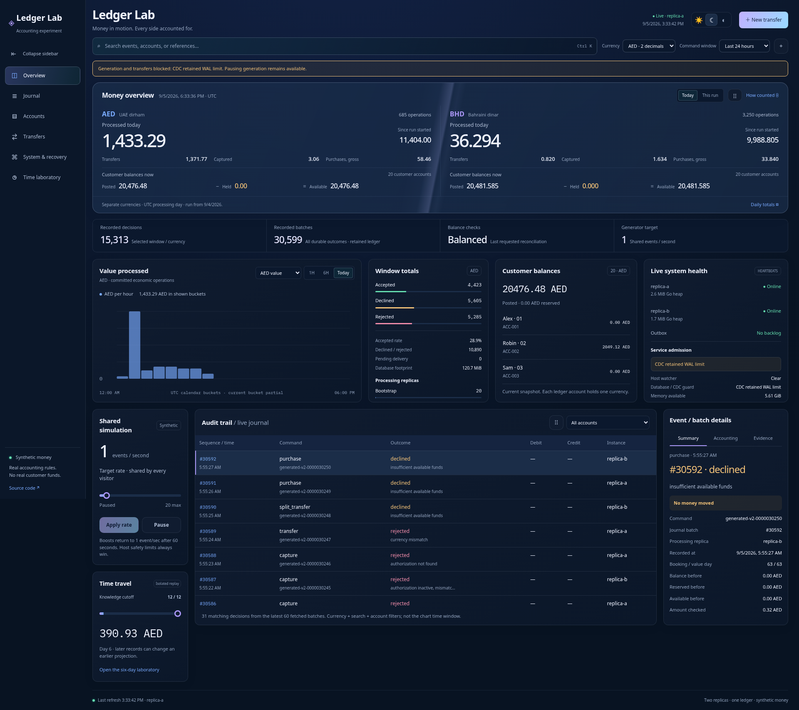

# Ledger Lab

## A ledger you can inspect

Implementation guide and scaling plan - 5 September 2026

Ledger Lab is a working local simulation of a financial service. Two Go instances share PostgreSQL, accept commands, record balanced accounting entries and deliver notifications. A browser lets a reviewer inspect the decisions, change a bounded generator, move synthetic money and explore historical projections. An optional reporting path copies journal batches into Iceberg for ClickHouse to query.

The purpose is to make engineering choices observable: what commits together, what happens on retry, why a hold differs from a payment, and what a historical correction changes. There is no real money, external payment execution, licensed banking operation or production-readiness claim.

The Python assessment remains the reference exercise. This guide describes the Go service branch, not a replacement for the submitted assessment PDF. The six-day fixture remains isolated from the continuously advancing simulation.

### Read the claims correctly

- **Implemented** means there is a code path. It does not imply every failure mode was tested.
- **Observed** means a named local check produced evidence, at a particular cutoff and workload.
- **Proposed** means a next step, not a component secretly running in the background.

The [local evidence](evidence/2026-09-05/README.md) records a real CDC problem found during this review. Source financial admission stopped because retained WAL exceeded its guard. Both replicas and the CDC connection were still alive. Keeping that distinction visible is part of the demonstration, not something to hide behind a green dashboard.

### What is present

| Present locally | Deliberately not claimed |
| --- | --- |
| Two identical Go replicas and one PostgreSQL primary | Database or host high availability |
| Exact money, balanced postings, durable idempotency | FX, a complete banking product or regulatory compliance |
| Holds, final partial capture, calendar close work | General authorization expiry/refund/product lifecycles |
| Signed HTTP outbox delivery with receiver deduplication | Exactly-once network transport |
| CDC, Iceberg REST/object storage and ClickHouse experiments | Reliable unattended reporting or indefinite retention |
| Independent synthetic opening-statement comparison | Complete external bank reconciliation |

<!-- page -->

## Where the money comes from

A ledger records a claim about money; it cannot create an external bank deposit. Here, fictional funding increases a settlement asset and the customer's deposit liability by the same amount. The settlement account represents the boundary to the outside world. No payment rail confirms it, and there is no separate `WORLD` service.

For an illustrative AED 100.00 deposit, debit the settlement asset 100.00 and credit the customer liability 100.00. For an AED 10.00 transfer, debit customer A's liability and credit customer B's liability. One customer is owed less, the other more; the aggregate customer liability does not grow. A chart must count the transfer as 10.00, not add both sides and show 20.00.

| Operation | Debit | Credit | Customer liability total |
| --- | --- | --- | --- |
| Deposit AED 100.00 | Settlement asset 100.00 | Customer A 100.00 | Increases 100.00 |
| Transfer AED 10.00 | Customer A 10.00 | Customer B 10.00 | Unchanged |
| Hold AED 5.00 | No monetary posting | No monetary posting | Unchanged; 5.00 reserved |

The current ledger account is single-currency. A multi-currency customer wallet would group separate AED and BHD accounts. That grouping and FX are not implemented. AED uses two decimals, BHD three. API amounts use integer minor-unit strings, calculations are exact, and the UI formats them without converting them to binary floating-point money.

### Reservations, postings and corrections

A hold reduces available funds without posting a monetary movement. Final capture posts the captured amount and releases any remainder. A matched retry returns the original result, not a second payment. A request with the same ID and different contents conflicts. A different ID with the same amount can be a legitimate second payment; idempotency is not guessing business identity from similar values.

Append-only means existing financial facts are not edited. A new linked correction can affect the balance projected for an earlier value day. Booking day describes when the business records the operation; value day says which day it affects economically; journal sequence identifies a committed knowledge prefix within a run. A row also has a creation timestamp, but that timestamp is not a substitute for the transactionally ordered sequence.

The six-day fixture demonstrates historical fees and a principal-only reversal. Live commands use the current simulation day and do not inherit a general backdated-correction workflow. Live close jobs accrue interest and capitalize six rounded daily amounts every sixth simulation day. That is a simulation cadence, not a calendar month. Missing policy blocks the affected close instead of inventing a fee.

### What the money overview measures

Processed value is successful transfers (including the original total of a split), final captures and gross purchases, counted once. Funding, holds, retries, declines, rejections, reversals and calendar maintenance are excluded. Current customer posted, held and available balances are stocks, not processed flows or profit. Each currency and UTC processing-time window stays separate. The financial endpoint aggregates the complete selected run in one database query snapshot, not the visible journal preview. Current-day and current-bucket values are partial.

<!-- page -->

## One commit, two independent delivery paths

```text
Browser / bounded generator
          |
     local reverse proxy
          |
    Go A or Go B
          |
    PostgreSQL transaction
    identity + account locks + journal order
    result + balances + postings + outbox
          |
          +-- outbox worker -- signed HTTP -- deduplicating inbox
          |
          +-- WAL / pgoutput -- CDC -- Iceberg -- ClickHouse
```

PostgreSQL is the financial source of truth. The outbox and the reporting lake are separate consumers; neither is consulted to authorize a transfer. Local SQL migrations and SQLC-generated queries make schema and query changes reviewable. Go owns policy and transaction boundaries. The browser is presentation, not an accounting authority.

Command processing obtains a shared run-lifecycle lock, fences generated work when applicable, claims the command identity, locks affected accounts in sorted order, resolves authorization and takes a short journal-order lock. The outcome, balance changes, postings, envelope and notification work commit together. A rollback leaves no half-transfer. Sorted locks reduce account-lock deadlocks; they do not eliminate every possible contention or operational error.

The sequence is allocated through a transactional per-run clock. It supports complete-prefix reads without assuming a database sequence's allocation order equals commit order. That clock is also a deliberate serialization point. Two replicas demonstrate concurrent callers and replica recovery, not twice the write capacity or an independently writable database cluster.

### At least once, with a stable identity

An outbox worker can send a notification and lose the acknowledgement. Retrying is correct. A receiver uses the same run/sequence identity to deduplicate delivery, while an append-only attempt trail explains retries. The local receiver shares PostgreSQL with the sender, so this exercise is not an independently failing external bank or region.

CDC captures only journal envelopes. It must advance its acknowledged source position only according to its durable sink/checkpoint protocol. A complete-envelope comparison at a fixed cutoff is stronger than matching row counts. It is still not a continuous freshness watermark, an off-host backup or proof of power-loss recovery.

### Trust boundaries

Separate owner, application, watcher and CDC roles have different responsibilities. Local passwords are disposable development values; public deployment requires fresh scoped secrets, TLS and private database/catalog access. Durability does not stop a stolen credential from deleting permitted data, corrupting a writable catalog, leaking data or generating bills. Least privilege, secret isolation and recoverable backups address different risks.

<!-- page -->

## What the small host actually has to carry

The full default configuration contains eight continuous services, with memory ceilings totaling 3,056 MiB. The experimental budget totals 1,280 MiB; the further compact overlay totals 1,152 MiB. Those are limits, not measured steady consumption or sufficient VM sizes. Leave additional headroom for the OS, Docker, startup, filesystem cache and maintenance.

In the new observation, main CDC used about 506 MiB and the lake/catalog about 287 MiB; PostgreSQL about 142 MiB and ClickHouse about 171 MiB. The two Go APIs together used about 31 MiB. CDC is a large consumer, but not the only one. The compact connector was about 299 MiB while paused: comparing these two numbers does not isolate a configuration improvement.

### The failure is more specific than "Java is heavy"

The demo stopped admitting financial commands after retained WAL exceeded 256 MiB. PostgreSQL's slot was still active. CDC repeatedly timed out saving offsets, while an observed offset-table commit took 33 seconds. The one-row offset table retained thousands of snapshots. Around 6.4 MB of current journal data files coexisted with 8.7 GiB of lake filesystem allocation. Historical files, catalog metadata and storage-engine allocation cannot be ignored.

These observations establish checkpoint/retention trouble, not a proven single cause. Low CPU limits, object-store latency and growing metadata are candidates to isolate. No slot was advanced, dropped or silently recreated to make the status green. The prior short compact test did not establish long-running stability.

The new fixed-cutoff lake comparison matched the first 8,000 batches, then failed on the next query's 15-second ClickHouse deadline. Full agreement was not established. Internal ledger reconciliation remained clean at cutoff 30,599; those are different checks.

### First tuning experiment, not approved settings

- Establish a baseline at idle, one event/second, a bounded burst, outage catch-up and maintenance. Record p95/p99 HTTP latency, actual commits/second, source/sink cutoffs, memory high-water marks, disk allocation and WAL generation. Measure successful work, not just the slider target.
- Trial a 30-second checkpoint interval with a 60-second flush timeout in an isolated profile. These are starting hypotheses, not promises. Fewer commits trade freshness and replay work for lower metadata/request overhead; a longer timeout alone does not fix growing metadata.
- Trial a smaller connector batch (128), queue (512) and byte bound (8 MiB), verifying support in the pinned release. Queue limits do not bound all writer, JVM or native allocations. Serial GC is already active; do not count enabling it as a new saving. [Debezium configuration](https://debezium.io/documentation/reference/stable/connectors/postgresql.html)
- Test heartbeat-driven offset progress when journal writes stop but operational tables still change. If a heartbeat table/query is needed, give it narrowly scoped privileges and publication membership; never insert fake financial events. Verify sink filtering and recovery before enabling it.
- Qualify snapshot expiration, metadata cleanup and small-file compaction separately. Expiring old snapshots is different from deleting old metadata versions. Never delete files still referenced by a retained snapshot or an in-flight writer. [Iceberg maintenance](https://iceberg.apache.org/docs/latest/maintenance/)

Do not solve a slow sink by lowering the slot ceiling until it loses required WAL, relaxing the admission guard or giving the container unlimited swap.

<!-- page -->

## PostgreSQL, OLake and scheduled jobs

PostgreSQL currently keeps durability settings enabled: `fsync`, full-page writes and synchronous commit. Preserve them. A 192 MiB database container with 48 MiB shared buffers still needs memory for connections, per-operation work, logical decoding and vacuum. `work_mem` is not a whole-server limit; concurrent operations can each use it. Trial smaller decoding/maintenance budgets with spill and vacuum measurements, rather than disabling maintenance. Application pools currently allow six connections per instance; include watcher, CDC, migrations and diagnostics when sizing the database connection limit. [PostgreSQL resources](https://www.postgresql.org/docs/18/runtime-config-resource.html)

`max_slot_wal_keep_size=512MB` is checked at checkpoint time and can make a lagging slot unusable; it is not a precise disk quota. `max_wal_size=1GB` is not a hard filesystem cap either. Track current WAL generation, retained bytes, slot invalidation and disk reserve. An approximate outage budget is usable WAL headroom divided by observed peak WAL bytes/second, with margin. All database activity can contribute WAL, not only published journal records. [Replication settings](https://www.postgresql.org/docs/18/runtime-config-replication.html)

### OLake is a candidate, not a measured replacement

The CLI accepts source, stream-selection and destination files plus a separate checkpoint file. Keep non-secret configuration declarative and versioned; store mutable state durably outside Git. Our Debezium properties are already declarative. OLake avoids needing its UI stack, but its Iceberg path still includes Java for metadata work alongside Go/Arrow data writing. Its bulk-ingestion claims do not establish lower memory for this workload. [OLake CLI](https://olake.io/docs/community/commands-and-flags/), [release image](https://github.com/datazip-inc/olake/blob/v0.9.5/Dockerfile)

Qualify a pinned CLI in a separate slot and destination namespace. Compare exact envelopes, duplicate identities, initial snapshot, quiet-source progress, crash-after-commit recovery, lost state, unavailable WAL and total Go-plus-Java memory. Confirm catalog authentication and ARM support. Keep a deliberate rollback/resnapshot procedure. OLake's documented destination commit markers are relevant evidence, not an end-to-end guarantee for an untested integration. [Recovery design](https://olake.io/blog/exactly-once-delivery-iceberg/)

### GitHub Actions: useful for evidence, not the always-on consumer

Standard hosted runners are free for public repositories; larger runners are not. That is a billing rule, not unlimited application hosting permission. Scheduled runs can be delayed or dropped, run from the default branch and can be disabled after inactivity; hosted jobs also have a six-hour limit. Do not chain jobs to simulate a permanent CDC host. Our existing CI uses Actions for tests, which is a straightforward fit. A bounded, project-related replay/reporting test is a better use than making the live platform depend on a cron job. [Billing](https://docs.github.com/en/billing/concepts/product-billing/github-actions), [scheduling](https://docs.github.com/en/actions/reference/workflows-and-actions/events-that-trigger-workflows#schedule), [limits](https://docs.github.com/en/actions/reference/limits), [terms](https://docs.github.com/en/site-policy/github-terms/github-terms-for-additional-products-and-features#actions)

If a finite external data job is later adopted, it still needs a fenced single writer, durable checkpoint storage, private network access and enough WAL retention for delayed/missed runs. Use protected workflows and short-lived scoped credentials where supported. Do not execute untrusted PR code in a secret-bearing job. Artifacts/cache are not the sole recovery database. These controls reduce exposure; they cannot make a compromise harmless.

<!-- page -->

## Growth: count the work before choosing the cluster

The current run is deliberately finite: shared admission is capped at 20 operations/second and a 100,000 journal-position ceiling. Replays do not necessarily append a batch; calendar work and other accepted commands also consume the shared budget. Run rotation and retention are unfinished. Continuous indefinite generation is not implemented just because a process remains running.

For sizing only, assume each event below creates one new batch and runs continuously. This is a workload model, not observed throughput. At one batch/second, the 100,000-batch allowance lasts about 27.8 hours; at twenty, about 1.39 hours. A 100-fold rate increase cannot be exercised by the current public controls.

| Hypothetical batches/second | Batches/day | Batches in two days | Journal at assumed 2 KiB/batch/day |
| --- | ---: | ---: | ---: |
| 1 | 86,400 | 172,800 | 169 MiB |
| 20 | 1,728,000 | 3,456,000 | 3.30 GiB |
| 100 | 8,640,000 | 17,280,000 | 16.48 GiB |

The 2 KiB allowance is an explicit scenario input, not a measured multiplier. Add command results, posting rows and indexes, notification attempts, WAL, backups, lake metadata/history and compaction scratch space separately. In the observed database, command results alone occupied roughly 39 MiB and the journal roughly 36 MiB. Repeatedly rewriting metadata can dominate when economic activity is low. Measure bytes per successful operation and per idle hour independently.

### Where this implementation spends work

- **Commit path:** a constant number of affected accounts for ordinary operations, indexed lookups and posting inserts. B-tree work grows approximately logarithmically with table size, but lock waits, WAL flush latency and contention can dominate. Splits add work proportional to the number of parts. This is not the Python replay's retained-prefix memory pattern.
- **Shared ordering:** the per-run journal clock, generator fence and admission row serialize parts of the workload. Hot settlement/tax accounts create additional contention. Adding API replicas cannot remove these database bottlenecks.
- **Statements:** indexed pagination bounds returned rows, but prefix totals rescan the account's qualifying history. Exporting many pages repeats that scan; with a fixed page size, total work can approach quadratic growth in posting count. A fixed-cutoff checkpoint balance or one server-streamed export is a cheaper next step than sharding.
- **Analytics:** event windows and financial run totals currently scan qualifying records. The new financial query is deadline-bounded and returns fixed-size aggregates, but bounded output does not make scan cost constant. Read models and measured indexes precede more replicas.
- **Reporting:** files, snapshots and metadata accumulate until maintenance removes obsolete material safely. A smaller JVM does not change that asymptotic storage problem.

Measure query plans, lock wait time, transaction latency, WAL throughput and maintenance peaks at increasing retained history. Do not convert this complexity discussion into an unmeasured transactions-per-second claim.

<!-- page -->

## Partitioning, sharding and high availability are different changes

**Partitioning** divides large tables inside one logical database. It can make pruning and lifecycle management cheaper; it does not add another writer or remove a hot account lock. Start with observed query patterns and an archive/restore contract.

The existing keys already include `run_id`, which is a plausible partition boundary for independently retained simulation runs. Partitioning by recording time may suit long-lived journals, but the current primary keys and foreign keys do not include that time. PostgreSQL partitioned uniqueness generally requires the partition key in the unique constraint. A date partition is therefore a schema/identity migration, not one line of DDL. Partitioning by value day would also make historical corrections and retention harder to reason about. [PostgreSQL partitioning](https://www.postgresql.org/docs/18/ddl-partitioning.html)

Before detaching anything, verify source-to-lake completeness, immutable archive identity, historical statement reads, legal retention requirements for any real product, backup restoration and references from outbox/period records. Expiring analytical snapshots is not permission to delete the source journal.

**Sharding** gives independent data owners independent databases. First shard by a tenant/ledger boundary that keeps one atomic transfer, authorization and idempotency identity together. The present `run_id` provides namespace separation, not an implemented shard router or security tenant model. Keep ordering per ledger rather than promising a global sequence across independent writers.

Cross-shard transfers need an explicit protocol: reserve funds, record durable transfer state, move through clearing accounts and resolve retries/timeouts without spending twice. A saga is not the same as one atomic database transfer. Distributed transactions add their own availability and operational costs. Do not shard by account hash and quietly preserve the old atomicity claim. Hot shared settlement accounts may need partitioned clearing subaccounts and reconciliation, not merely more API pods.

**High availability** addresses failure domains. Two API replicas on one machine tolerate selected application failures, not machine loss. PostgreSQL primary/standby replication, failover fencing, CDC-slot continuity, backups and a tested restore are separate work. Choose synchronous versus asynchronous replication by an explicit acknowledged-data-loss and latency policy. Backups are still needed because replicas can copy mistakes.

**ClickHouse clustering** is a separate reporting concern. Add query replicas, sharded local tables or coordinated replicated tables only after measuring query needs and establishing their ingestion/deduplication contracts. A distributed query layer over an Iceberg catalog does not become the financial writer. The current single ClickHouse instance is not a cluster, and no Kafka or RabbitMQ broker is hidden in this architecture.

The cheapest order is usually: remove redundant work, maintain storage, fix slow queries and reads, isolate independent workloads, then add replicas or shards for a measured reason. Here the observed checkpoint failure comes before a clustering exercise.

<!-- page -->

## Reporting models and transformations

Keep the immutable journal envelope as the raw evidence layer. A proposed analytical model then expands that envelope into typed facts: one row per evaluated command, one per posting leg and one per account/day basis. Curated summaries serve processed value, outcomes, account statements and operational trends. These are derived views, not new authority to approve money.

```text
Raw journal envelope + source identity + ingestion position
                     |
          validated typed facts
          commands / postings / daily basis
                     |
       account-day and currency-period summaries
                     |
           dashboard / BI / exports
```

Use `(run_id, sequence)` for batch identity and add `leg` for postings. Preserve booked day, value day and source knowledge position as different fields. Deduplicate identical redelivery before aggregate models; a conflicting payload under one source identity should fail validation, not be arbitrarily selected. Store minor units in exact integer/decimal types with enough aggregate headroom. AED plus BHD is never a valid total without an explicit FX policy.

### Where dbt fits

dbt could version SQL transformations, dependencies, tests and documentation against ClickHouse. It does not consume PostgreSQL WAL, enforce source financial transactions or guarantee exactly-once ingestion. The ClickHouse adapter must be pinned and its supported materializations verified. Start with a small scheduled batch of models rather than another permanent service. dbt and Metabase integration are not implemented in this branch. [ClickHouse/dbt](https://clickhouse.com/docs/integrations/connectors/data-ingestion/etl-tools/dbt)

Incremental models should advance by an established completed source prefix, not merely the largest sequence visible in a partially delivered lake. A later sequence does not prove all earlier ones arrived. Reprocess the affected account/day when a new value-dated correction changes historical results; a filter on today's value date would miss it. Retain model version, source cutoff and run timestamp so a published result is explainable. A dbt `unique_key` is configuration for a merge strategy, not evidence that source rows were unique. [dbt incremental models](https://docs.getdbt.com/docs/build/incremental-models)

Proposed tests: unique batch/leg identities; complete envelope agreement; per-batch currency balance; posting-to-account relationship; processed value counted once; stock versus flow separation; held/available consistency; UTC window edges; exact BHD allocation and half-even tax ties; historical correction recomputation; incomplete-prefix refusal. Tests for missing records need an independent source manifest/count/hash contract, not two views of the same incomplete table.

Expose the last validated reporting cutoff and age. An API heartbeat or active replication slot must not turn a stale warehouse green. Begin with bounded views or one small incremental table; measure full-refresh cost, compaction scratch space and BI query limits before introducing more tools.

<!-- page -->

## A small, credible next release

The immediate deliverable is the complete v2 frontend connected to real data, a separate implementation guide/PDF, and evidence in the open PR. It is not deployment approval. The existing submitted architecture PDF stays unchanged. The source-code and test changes, exact commands, failures and screenshots are linked from the evidence record and worklog.

### What must be demonstrated before moving the full stack

- CDC makes durable progress while the journal is quiet and operational writes continue. A sink outage recovers without advancing past missing data.
- A fixed-cutoff envelope comparison passes after restart. Missing offsets or invalidated WAL cause an explicit recovery requirement, not silently skipped records.
- Snapshot/file maintenance stabilizes allocated storage under a defined retention policy. The maintenance job itself fits memory, CPU and scratch-space limits.
- Source run rotation and archival are either implemented and tested or the demo visibly reaches a finite stop. A permanent loop is not substituted for bounded history.
- Public operations retain low-rate admission, scoped credentials, private storage and a host reserve that protects unrelated workloads. Memory ceilings plus real maintenance headroom fit the chosen host.
- A backup is restored outside the original volumes and its contents are checked. Container restart with preserved volumes is useful evidence, not equivalent to disaster recovery.

A full stack may fit a small VM after tuning, but we do not yet have a minimum safe RAM or sustained throughput guarantee. Moving the lake/catalog to a managed object store can remove local memory pressure while adding request costs and compatibility checks. A connector replacement must earn its place through the same recovery tests. The separate hosting investigation is a decision aid, not a reason to publish account credentials or claim a free-tier entitlement this repository cannot reproduce.

### Rebuild and review

Run `docker compose up --build -d` from the repository root for the core, and use the lake instructions for the optional reporting profile. Never use the local credentials on a public host. The service README lists bounded verification commands; destructive recovery drills are deliberately separate from ordinary startup.

This Markdown is the editable source for `output/pdf/ledger-lab-implementation-guide.pdf`. Rebuild with `python3 tools/build_ledger_guide_pdf.py` in an environment with the pinned document dependencies from `tools/requirements-guide.txt`. The builder does not touch the assessment PDF. The new PDF is longer than the assessment's page limit because it documents a different, expanded project.

Changes to code, configuration and operational claims remain reviewable on `feat/go-ledger-service`. The PR stays open; no production-critical service was stopped to create these artifacts.

<!-- page -->

## Reading the running interface

The supplied v2 design is the actual frontend, connected to the local service. This capture shows existing synthetic history while the source-side CDC guard prevents new financial work. The charts and balances are not seeded display data, and the warning is not hidden for the screenshot.



| What the reviewer sees | What it establishes |
| --- | --- |
| AED and BHD money columns | Separate exact currency values; no blended total |
| Processed today versus run totals | Economic flow over a named UTC period |
| Posted minus held equals available | Current customer balance stocks, not revenue |
| Value/command chart selector | Monetary movement and recorded decisions are different metrics |
| Journal and event evidence | A recorded outcome, its processing instance and accounting legs |
| Admission warning | Healthy API processes do not imply that new financial work is safe |

Pause monetary display freezes only that snapshot. Pause journal freezes only the event view. Pause generation changes the shared generator. Those are separate controls, and none can override database or host guards. Theme and visual-effects controls change presentation only.

The [full screenshot and verification set](evidence/2026-09-05/README.md) includes light mode, mobile Overview and Journal, and the System workspace. It also records route geometry checks, fixed-cutoff statement pagination/CSV, internal reconciliation and stale-data handling. Browser captures show an instant, not a throughput benchmark or a complete accessibility audit.
